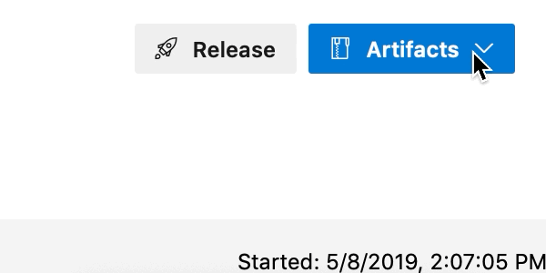
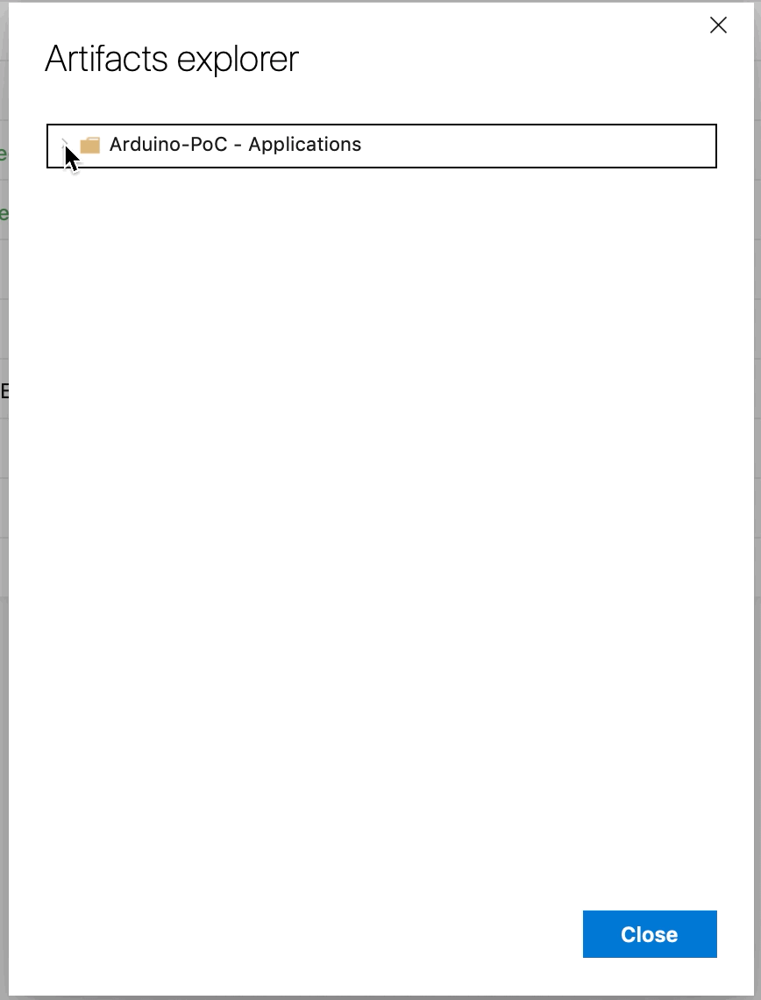

# Arduino IDE PoC

[](https://dev.azure.com/typefox/Arduino/_build/latest?definitionId=4&branchName=master)

> **Beware:** This is very much work-in-progress. Things can and probably will be broken, even on master.

This repo contains a proof-of-concept for an Arduino IDE based on Theia.
It's built on top of a [fork of the arduino-cli](https://github.com/typefox/arduino-cli/tree/daemon) that sports a gRPC interface.

## How to try (offline)

```
git clone https://github.com/bcmi-labs/arduino-editor
cd arduino-editor
yarn
yarn rebuild:electron
yarn --cwd arduino-ide-electron start
```

If you want to switch back to the browser-based example, execute the following in the repository root
```
yarn rebuild:browser
```
Then you can start the browser example again:
```
yarn --cwd arduino-ide-browser start
```

## Arduino-PoC Electron Application
The project is built on [Azure DevOps](https://dev.azure.com/typefox/Arduino).

Currently, we provide the Arduino-PoC for the following platforms:
 - Windows,
 - macOS, and
 - Linux.
   
You can download the latest release applications fom [here](https://github.com/bcmi-labs/arduino-editor/releases/latest).
If you want to get a nightly build, go to the [Azure DevOps page](https://dev.azure.com/typefox/Arduino/_build?definitionId=4),
and follow the steps from below.

 
 

Click [here](./electron/README.md) for more details on the CI/CD, the GitHub release, and the build process in general.