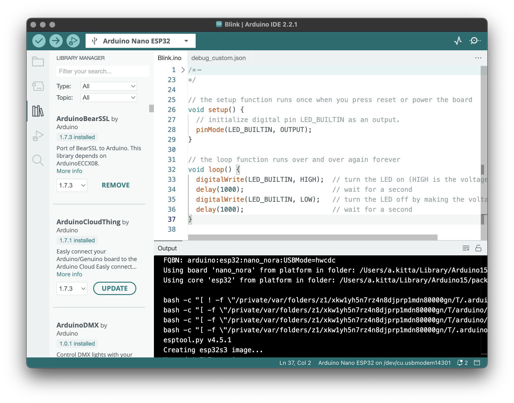

# Arduino IDE 2.x (beta)

This repository contains the source code of the Arduino IDE 2.x, which is currently in beta stage. If you're looking for the stable IDE, go to the repository of the 1.x version at https://github.com/arduino/Arduino.

The Arduino IDE 2.x is a major rewrite, sharing no code with the IDE 1.x. It is based on the [Theia IDE](https://theia-ide.org/) framework and built with [Electron](https://www.electronjs.org/). The backend operations such as compilation and uploading are offloaded to an [arduino-cli](https://github.com/arduino/arduino-cli) instance running in daemon mode. This new IDE was developed with the goal of preserving the same interface and user experience of the previous major version in order to provide a frictionless upgrade.

> ⚠️ This is **beta** software. Help us test it!

## Download

You can download the latest version from the [software download page on the Arduino website](https://www.arduino.cc/en/software#experimental-software).
### Nightly builds

These builds are generated every day at 03:00 GMT from the `main` branch and
should be considered unstable:

Platform  | 32 bit                   | 64 bit                                                                                                 |
--------- | ------------------------ | ------------------------------------------------------------------------------------------------------ |
Linux     |                          | [Nightly Linux 64 bit]                                                                                 |
Linux ARM | [🚧 Work in progress...] | [🚧 Work in progress...]                                                                              |
Windows   |                          | [Nightly Windows 64 bit installer] [Nightly Windows 64 bit MSI] [Nightly Windows 64 bit ZIP] |
macOS     |                          | [Nightly macOS 64 bit]                                                                                 |

[🚧 Work in progress...]: https://github.com/arduino/arduino-ide/issues/107
[Nightly Linux 64 bit]: https://downloads.arduino.cc/arduino-ide/nightly/arduino-ide_nightly-latest_Linux_64bit.zip
[Nightly Windows 64 bit installer]: https://downloads.arduino.cc/arduino-ide/nightly/arduino-ide_nightly-latest_Windows_64bit.exe
[Nightly Windows 64 bit MSI]: https://downloads.arduino.cc/arduino-ide/nightly/arduino-ide_nightly-latest_Windows_64bit.msi
[Nightly Windows 64 bit ZIP]: https://downloads.arduino.cc/arduino-ide/nightly/arduino-ide_nightly-latest_Windows_64bit.zip
[Nightly macOS 64 bit]: https://downloads.arduino.cc/arduino-ide/nightly/arduino-ide_nightly-latest_macOS_64bit.dmg

> These links return an HTTP `302: Found` response, redirecting to latest
  generated builds by replacing `latest` with the latest available build
  date, using the format YYYYMMDD (i.e for 2019/Aug/06 `latest` is
  replaced with `20190806`)

## Support

If you need assistance, see the [Help Center](https://support.arduino.cc/hc/en-us/categories/360002212660-Software-and-Downloads) and browse the [forum](https://forum.arduino.cc/index.php?board=150.0).

## Bugs & Issues

If you want to report an issue, you can submit it to the [issue tracker](https://github.com/arduino/arduino-ide/issues) of this repository. A few rules apply:

* Before posting, please check if the same problem has been already reported by someone else to avoid duplicates.
* Remember to include as much detail as you can about your hardware set-up, code and steps for reproducing the issue. Make sure you're using an original Arduino board.

### Security

If you think you found a vulnerability or other security-related bug in this project, please read our
[security policy](https://github.com/arduino/arduino-ide/security/policy) and report the bug to our Security Team 🛡️
Thank you!

e-mail contact: security@arduino.cc

## Contributions and development

Contributions are very welcome! You can browse the list of open issues to see what's needed and then you can submit your code using a Pull Request. Please provide detailed descriptions. We also appreciate any help in testing issues and patches contributed by other users.

This repository contains the main code, but two more repositories are included during the build process:

* [vscode-arduino-tools](https://github.com/arduino/vscode-arduino-tools): provides support for the language server and the debugger
* [arduino-language-server](https://github.com/arduino/arduino-language-server): provides the language server that parses Arduino code

See the [BUILDING.md](BUILDING.md) for a technical overview of the application and instructions for building the code.
## Donations

This open source code was written by the Arduino team and is maintained on a daily basis with the help of the community. We invest a considerable amount of time in development, testing and optimization. Please consider [donating](https://www.arduino.cc/en/donate/) or [sponsoring](https://github.com/sponsors/arduino) to support our work, as well as [buying original Arduino boards](https://store.arduino.cc/) which is the best way to make sure our effort can continue in the long term.

## License

The code contained in this repository and the executable distributions are licensed under the terms of the GNU AGPLv3. The executable distributions contain third-party code licensed under other compatible licenses such as GPLv2, MIT and BSD-3. If you have questions about licensing please contact us at [license@arduino.cc](mailto:license@arduino.cc).
