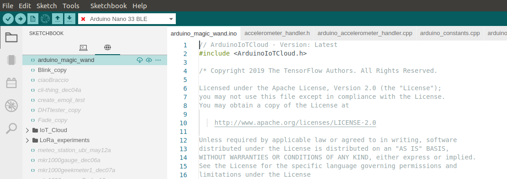

# Remote Sketchbook

Arduino IDE provides a Remote Sketchbook feature that can be used to upload sketches to Arduino Cloud.



In order to use this feature, a user must be registered on [Arduino Cloud](https://store.arduino.cc/digital/create) and logged in.
This feature is completely optional and can be disabled in the IDE via _"File > Advanced > Hide Remote Sketchbook"_ menu item.

## Developer guide
A developer could use the content of this repo to create a customized version of this feature and implement a different remote storage as follows:

### 1. Changing remote connection parameters in the Preferences panel (be careful while editing the Preferences panel!)
Here a screenshot of the Preferences panel

- The settings under _Arduino > Auth_ should be edited to match the OAuth2 configuration of your custom remote sketchbook storage
- The setting under _Arduino > Sketch Sync Endpoint_ should be edited to point to your custom remote sketchbook storage service
### 2. Implementing the Arduino Cloud Store APIs for your custom remote sketchbook storage
Following the API Reference below:

| API Call  | OpenAPI documentation |
| ------------- | ------------- |
| DELETE create/v2/files/d/$HOME/sketches_v2{posixPath} | https://api2.arduino.cc/create/docs#!/files95v2/files_v2_deletedir |
| DELETE create/v2/files/f/$HOME/sketches_v2{posixPath} | https://api2.arduino.cc/create/docs#!/files95v2/files_v2_deletefile |
| GET create/v2/files/d/$HOME/sketches_v2{posixPath} | https://api2.arduino.cc/create/docs#!/files95v2/files_v2_list |
| GET create/v2/files/f/$HOME/sketches_v2{posixPath} | https://api2.arduino.cc/create/docs#!/files95v2/files_v2_read |
| GET create/v2/sketches | https://api2.arduino.cc/create/docs#!/sketches95v2/sketches_v2_search |
| GET create/v2/sketches/byID/{id} | https://api2.arduino.cc/create/docs#!/sketches95v2/sketches_v2_byID |
| GET create/v2/sketches/byPath{path} | https://api2.arduino.cc/create/docs#!/sketches95v2/sketches_v2_byPath |
| POST create/v2/files/d/$HOME/sketches_v2{posixPath} | https://api2.arduino.cc/create/docs#!/files95v2/files_v2_mkdir |
| POST create/v2/files/f/$HOME/sketches_v2{posixPath} | https://api2.arduino.cc/create/docs#!/files95v2/files_v2_write |
| POST create/v2/sketches/{sketch.id} | https://api2.arduino.cc/create/docs#!/sketches95v2/sketches_v2_edit |
| POST create/v3/files/cp | https://api2.arduino.cc/create/docs#!/files95v3/files_v3_copy |
| POST create/v3/files/mv | https://api2.arduino.cc/create/docs#!/files95v3/files_v3_move |
| PUT create/v2/sketches | https://api2.arduino.cc/create/docs#!/sketches95v2/sketches_v2_create |

## Build the Arduino IDE with this extension

To build the Arduino IDE with this extension, run the following in a terminal. On Windows, use _Git Bash_.
```sh
./bootstrap.sh
```