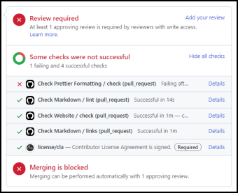

<!-- Source: https://github.com/arduino/tooling-project-assets/blob/main/documentation-templates/contributor-guide/general/contributor-guide/pull-requests.md -->

# Pull Request Guide

A [**pull request**](https://docs.github.com/pull-requests/collaborating-with-pull-requests/proposing-changes-to-your-work-with-pull-requests/about-pull-requests) (PR) is the mechanism used to propose changes to the content of this project's repository.

If you are looking for ideas of what to work on, check [the list of open issue reports](https://github.com/arduino/arduino-ide/issues). Pull requests addressing any of those bug reports and feature requests are welcome.

## Contribution Workflow

Each contribution travels through a formal process which allows it to be efficiently incorporated into the project.

### 1. Plan

#### Research

Start by searching the repository for existing pull requests and issues related to your planned contribution so you can see any related conversations and proposals and avoid duplicate effort:

https://github.com/arduino/arduino-ide/issues?q=

#### Discussion

It can sometimes be useful to get feedback from others during the planning process. There are a couple good options for discussing planned development work:

- Talk with the user community on the [Arduino Forum](https://forum.arduino.cc/).
- Talk with Arduino developers on the [Arduino Developers Mailing List](https://groups.google.com/a/arduino.cc/g/developers).

### 2. Fork

Forking a GitHub repository creates a copy of it under your account. You will stage contributions in your fork of this project.

[More information about forking repositories](https://docs.github.com/get-started/quickstart/fork-a-repo)

#### Enabling CI in Your Fork

The repository is configured to run automated [continuous integration](https://wikipedia.org/wiki/Continuous_integration) (CI) checks and tests. It's a good idea to enable CI in your fork so you can make sure your work will pass the checks before you submit a pull request:

1. Open the homepage of your fork in the browser.
1. Click the "**Actions**" tab.
1. Click the <kbd>**I understand my workflows, go ahead and enable them**</kbd> button.
1. Some of the workflows will now need to be activated individually. Perform the following steps for each of the useful workflows listed on the left side of the page that have a "**!**" icon:
   1. Click on the workflow name.
   1. Click the <kbd>**Enable workflow**</kbd> button.

### 3. Clone

Cloning a repository creates a copy of it on your computer.

It is possible to make simple changes to your repository using the GitHub web interface without cloning the repository. However, the GitHub web interface is quite limiting so you will likely find the need to work with a clone (using **Git** directly or your choice of [Git client software](https://git-scm.com/downloads/guis)) for any significant development work.

[More information about cloning repositories](https://git-scm.com/docs/git-clone)

### 4. Branch

Create a branch in your fork to contain the changes for your contribution. You must make a separate branch in your fork for each pull request you submit.

[More information about branches](https://docs.github.com/pull-requests/collaborating-with-pull-requests/proposing-changes-to-your-work-with-pull-requests/about-branches)

### 5. Make a change

Some things to keep in mind:

- Make sure your change complies with the project's established style conventions.
- Remember to also update the documentation content in the repository if required by your changes.
- If the project contains a test suite, update or add tests according to your change as appropriate.

See [the development guide](../development.md#development-guide) for more information.

### 6. Test

Test your change carefully to make sure it works correctly and did not break other components of the project.

As a supplement for general testing, the project is set up with automated checks and tests to facilitate development.

See [the development guide](../development.md#development-guide) for instructions.

### 7. Commit

Once the work on your change is complete, add it to the revision history of the Git repository by making a commit.

Make sure to follow the [Commit Guidelines](#commit-guidelines).

[More information about commits](https://git-scm.com/docs/git-commit)

### 8. Push

If you're working from a [clone](#3-clone), you will need to push your commit to your fork on GitHub.

[More information about pushing commits](https://git-scm.com/docs/git-push)

#### Checking CI Results

If you have [enabled CI in your repository](#enabling-ci-in-your-fork), GitHub will run the relevant checks automatically every time you push a commit to your fork.

You can see the results of these checks by doing either of the following:

- Clicking the status icon (✔️ or ❌) shown to the right of a commit.
- Opening the repository's "**Actions**" tab.

### 9. Pull request

A pull request (PR) is a proposal to make a change in a repository. The repository maintainer is able to accept the changes you propose in a pull request by simply clicking a button.

[More information about pull requests](https://docs.github.com/pull-requests/collaborating-with-pull-requests/proposing-changes-to-your-work-with-pull-requests/about-pull-requests)

#### Scope

Each pull request should address a single bug fix or enhancement. If you have multiple unrelated fixes or enhancements to contribute, submit them as separate pull requests.

#### Description

Pull request title and description should follow [the same guidelines as commit messages](#commit-message).

If your pull request fixes an issue in the issue tracker, use [a closing keyword](https://docs.github.com/issues/tracking-your-work-with-issues/linking-a-pull-request-to-an-issue#linking-a-pull-request-to-an-issue-using-a-keyword) in the body to indicate this.

In some cases, it might make sense to request feedback on a proposal before it is ready to be merged. You can indicate this by starting the pull request title with **[WIP]** (work in progress). Once the pull request is ready to be merged, edit the title and remove the "[WIP]".

#### Cross-repository Contributions

Some proposals may require changes to multiple repositories. Pull requests should be submitted in parallel to each repository.

Clearly note any dependencies on other PRs in the description so that these can be evaluated by the reviewer and the merges coordinated.

---

Please check whether any changes are required to the related documentation content hosted in the separate dedicated repositories:

- [**arduino/docs-content**](https://github.com/arduino/docs-content)
- [**arduino/help-center-content**](https://github.com/arduino/help-center-content)

### 10. Resolve CI failures

Relevant checks will run automatically once you have submitted the pull request. Once these checks are finished, you can see a summary of the results near the bottom of the pull request page:

Failed checks will be indicated with an ❌. If any checks failed, please fix whatever caused it to fail. Click the "**Details**" link to the right of the check name to open the logs, which provide details about the failure.

---

**ⓘ** In some rare cases, a CI failure may be unrelated to the changes made in your pull request. So if the information in the logs doesn't seem relevant, please comment on the pull request to ask a maintainer to take a look.

---

When you push to the branch of your fork the pull request was submitted from, the commit is automatically added to the pull request. Don't create a new pull request to fix problems; update the existing pull request.

### 11. Resolve changes requested from reviews

Interested parties may review your pull request and suggest improvements.

To act on general review suggestions, you can add commits to the branch you submitted the pull request from, which will automatically be added to the pull request. Don't create a new pull request to act on review suggestions; update the existing pull request.

Reviewers may suggest specific changes, which can be applied by [clicking the <kbd>**Commit suggestion**</kbd> button](https://docs.github.com/pull-requests/collaborating-with-pull-requests/reviewing-changes-in-pull-requests/incorporating-feedback-in-your-pull-request#applying-suggested-changes).

[More information about pull request reviews](https://docs.github.com/pull-requests/collaborating-with-pull-requests/reviewing-changes-in-pull-requests/about-pull-request-reviews)

### 12. Merge

One of the repository maintainers can now choose to accept your proposed change. Once the pull request is [merged](https://docs.github.com/pull-requests/collaborating-with-pull-requests/incorporating-changes-from-a-pull-request/merging-a-pull-request), you can delete the branch you created in your fork for the pull request and delete the fork as well if you like.

Thanks so much for your contribution!

---

It is possible that the maintainers may decide a pull request doesn't align with Arduino's goals for the project and close it rather than merging. A record of the proposed changes will always be available on GitHub for future reference. If you think your modifications will be of use to others, you are welcome to maintain your own fork of the repository.

---

## Commit Guidelines

The commit history of a repository is an important resource for developers. Repositories may accumulate thousands of commits over the course of decades. Each individual commit contributes either to the commit history being pleasant and efficient to work with, or to it being a confusing mess. For this reason, it's essential for contributors to create clean, high quality commits.

### Scope

Commits must be "atomic". This means that the commit completely accomplishes a single task. Each commit should result in fully functional code. Multiple tasks should not be combined in a single commit, but a single task should not be split over multiple commits (e.g., one commit per file modified is not a good practice).

[More information about atomic commits](https://www.freshconsulting.com/insights/blog/atomic-commits/)

### Commit Message

The commit message documents what the change was and why it was done. A little effort now writing a good commit message can save future developers from wasted time and frustration trying to understand the purpose of a poorly documented commit.

#### Commit Message Title

- Use the [imperative mood](https://cbea.ms/git-commit/#imperative) in the title. 
  For example:
  > Use LED_BUILTIN macro in LED pin definition
- Capitalize the title.
- Do not end the title with punctuation.
- Do not use GitHub's default commit titles (e.g., "Update examples/Foo/Foo.ino").

#### Commit Message Body

- Separate title from the body with a blank line. If you're committing via GitHub or [GitHub Desktop](https://desktop.github.com/) this will be done automatically.
- Wrap body at 120 characters.
- Completely explain the purpose of the commit. 
  Include a rationale for the change, any caveats, side-effects, etc.

[More information on commit messages](https://cbea.ms/git-commit/)
