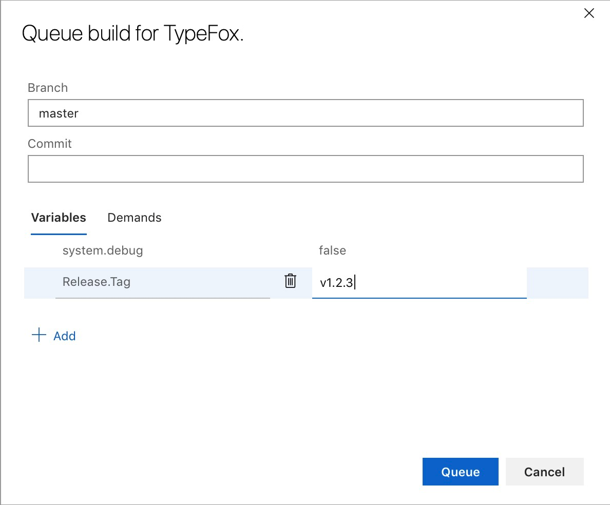
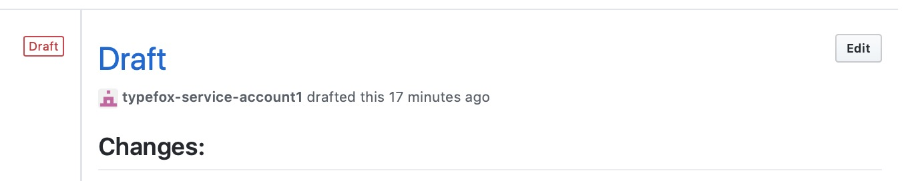
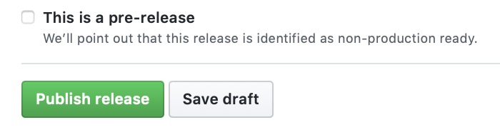

## Electron

All-in-one packager producing the `Arduino Pro IDE` Electron-based application.

## Prerequisites

The prerequisites are defined [here](https://github.com/theia-ide/theia/blob/master/doc/Developing.md#prerequisites).

## Build
To build the Arduino Pro IDE application you have to do the followings:
```bash
yarn --cwd ./electron/packager/ && yarn --cwd ./electron/packager/ package
```

The packaged application will be under the `./electron/build/dist` folder.

## CI
We always build an electron-based application for Windows. Create a PR, and the CI will automatically create the app for Windows. Do you need the builds for macOS and Linux? Start a build manually.

The electron packager runs when:
 - the build is manually triggered by the user, or
 - on scheduled (CRON) jobs.

## Creating a Release Draft
One can create a GitHub release draft, tag the source, and upload the artifacts to GitHub with Azure.
 - Go to the Azure [build](https://dev.azure.com/typefox/Arduino/_build) page.
 - Click on `Queue` in the top right corner.
 - Set the branch to `master` or leave as is if it is already showing `master`.
 - Add the `Release.Tag` pipeline variable and set the desired release version. Note, the version must start with `v` and we recommend naming tags that fit within [semantic versioning](https://semver.org).



 - Click on `Queue`.
 - 🎈🎉


## Publishing the Release Draft
One has to manually publish the GitHub release.
 - Go to the [release page](https://github.com/bcmi-labs/arduino-editor/releases) of the `arduino-editor` repository.
 - Select your release draft.
 - Click on `Edit`.



 - Optionally, you can adjust the release draft if you want.



 - Select `Publish release`.
 - ✨
